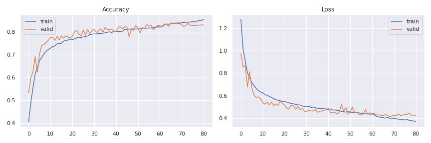
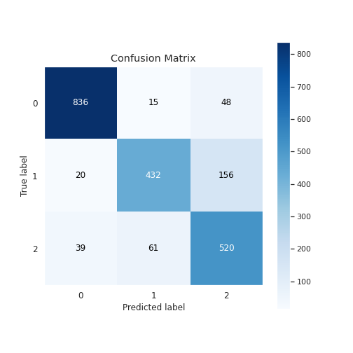

# Facial Emotion Recognition (FER)

I used the [FER](https://www.kaggle.com/ashishpatel26/facial-expression-recognitionferchallenge) dataset from [kaggle](https://www.kaggle.com/) for this task. The dataset is in the form of pandas dataframe. I first made the data compatible for the task. Also the original dataset contains 7 different emotion types. As the task assigned is for only 3 major emotions i.e., `happy`, `sad` and `neutral`, so I extracted these 3 classes from the dataset and train the model on them only.

I used a Deep Convolutional Neural Network (DCNN). For model generalization I used dropouts in regular intervals. I used `ELU` as the activation because it avoids dying relu problem and also performed well as compared to LeakyRelu atleast in this case. `he_normal` kernel initializer. `BatchNormalization` is also used for better results.

I used two callbacks one is `early stopping` for avoiding overfitting training data
and other `ReduceLROnPlateau` for learning rate. As the data in hand is less so I used `ImageDataGenerator`. I tried both `Nadam` and `Adam`, the results were similar.

The notebook is available [here](https://www.kaggle.com/gauravsharma99/facial-emotion-recognition?scriptVersionId=31791188).

The epoch's history shows that accuracy gradually increases and achieved +83% on both training and validation set, but at the end the model starts overfitting training data.

The confusion matrix clearly shows that our model is doing good job on the class `happy` but it's performance is low on other two classes. One of the reason for this could be the fact that these two classes have less data. But when I looked at the images I found some images from these two classes are even hard for a human to tell whether the person is sad or neutral. Facial expression depends on individual as well. `Some person's neutral face looks like sad face.`  

**Here is a sample gif showing the model performance.**

For better visuals you can download [this](https://github.com/greatsharma/Facial_Emotion_Recognition/blob/master/out.mov) and see locally.